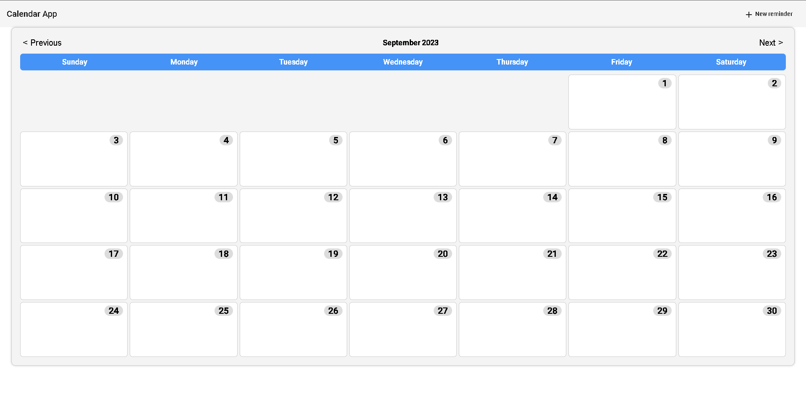

# Angular Calendar App

This Angular Calendar App is a simple web application that allows users to manage their reminders on a monthly calendar view. Users can add, edit, as well as view weather information associated with their reminders.

## Table of Contents

- [Features](#features)
- [Getting Started](#getting-started)
  - [Prerequisites](#prerequisites)
  - [Installation](#installation)
- [Running the App](#running-the-app)
- [Running Tests](#running-tests)
- [Build](#build)
- [Contributing](#contributing)
- [License](#license)

## Features

- Add reminders with a maximum of 30 characters. *(Click on the date or the new reminder button)*
- Specify the date, time, and city for each reminder.
- View reminders on a monthly calendar.
- Get weather information for the selected city when adding a reminder.
- Edit reminders.
- Responsive design for a seamless user experience on different devices.

## Getting Started

Follow these instructions to set up and run the project on your local machine.

### Prerequisites

- [Node.js](https://nodejs.org/) installed on your computer.
- Angular CLI installed globally. If not, you can install it using the following command: npm install -g @angular/cli@9

### Installation

1. Clone the repository to your local machine: git clone <repository-url>
2. Navigate to the project directory: cd AngularChallenge
3. Install project dependencies: run npm install

## Running the App

Run the development server using the Angular CLI: **ng serve**

The app will be available at **`http://localhost:4200/`**

## Running Tests

To run unit tests using [Jest](https://jestjs.io/docs/testing-frameworks), use the following command: **ng test**

## Contributing

Contributions are welcome! Please feel free to open issues or pull requests for any improvements or bug fixes.

